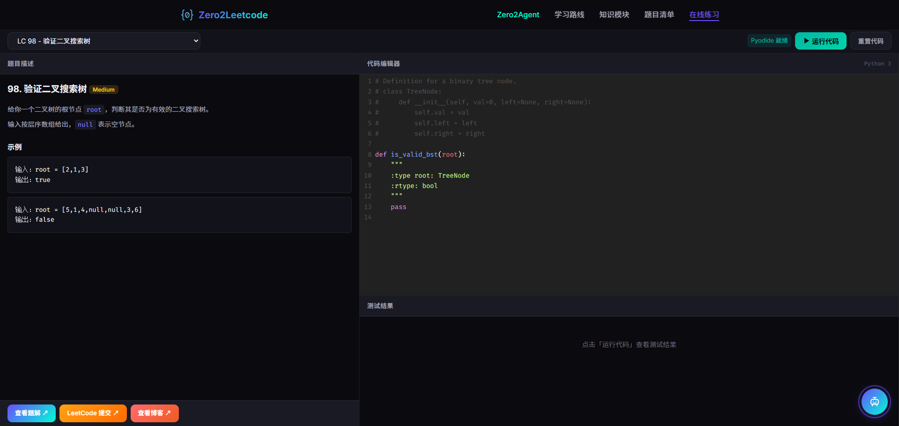
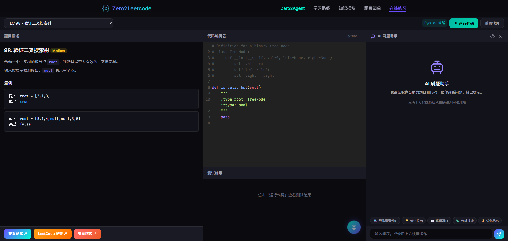
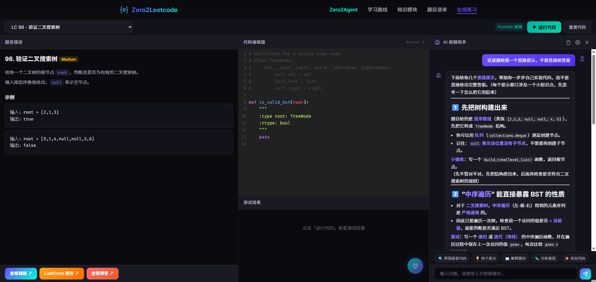

# OfferGo

<div align="center">

**大厂算法面试备考平台 — 真题 + 刷题 + AI 教练**

[](https://python.org)
[](https://leetcode.cn/studyplan/top-100-liked/)
[](#-ai-刷题助手)
[](LICENSE)

[在线练习场](playground.html) • [大厂真题](04_real_interviews/) • [面试经验](05_interview/) • [AI 助手](#-ai-刷题助手)

</div>

---

## 项目简介

OfferGo 专为**计算机求职者**设计，从 Python 零基础到通过大厂笔试面试，一站式备考。

### 核心亮点

- 🏢 **14 家大厂真题** — 阿里、字节、华为、美团等笔试面试真题，按公司分类
- 🖥️ **在线练习场** — 内置 98 道 Hot 100 题目，浏览器直接运行 Python
- 🎯 **ACM 模式** — 刷题界面内置 ACM 模式，支持 stdin/stdout
- 🤖 **AI 刷题助手** — 内置 AI 教练，自动读取题目和代码，给出诊断和提示
- 🗺️ **6 阶段学习体系** — 从 Python 基础到面试八股文，循序渐进
- 📝 **完整题解** — LeetCode Hot 100 全部题解

### 目标用户

- Python 零基础或仅掌握基础语法
- 准备校招/社招笔试机试
- 目标通过 LeetCode Medium 难度

---

## 本地部署

### 方式一：Jekyll（推荐，支持全站功能）

```bash
# 克隆项目
git clone https://github.com/mingsm17518/OfferGo.git
cd OfferGo

# 安装 Ruby 和 Jekyll（macOS）
brew install ruby
export PATH="/opt/homebrew/opt/ruby/bin:/opt/homebrew/lib/ruby/gems/4.0.0/bin:$PATH"
gem install bundler jekyll
bundle install

# 启动开发服务器
export PATH="/opt/homebrew/opt/ruby/bin:/opt/homebrew/lib/ruby/gems/4.0.0/bin:$PATH"
bundle exec jekyll serve --watch
# 访问 http://localhost:4000
```

> 建议将 Ruby PATH 写入 `~/.zshrc`，避免每次手动 export：
> ```bash
> echo 'export PATH="/opt/homebrew/opt/ruby/bin:/opt/homebrew/lib/ruby/gems/4.0.0/bin:$PATH"' >> ~/.zshrc
> ```

### 方式二：纯静态（仅需练习场）

```bash
git clone https://github.com/mingsm17518/OfferGo.git
cd OfferGo
python3 -m http.server 8080
# 首页:          http://localhost:8080
# 在线练习场:    http://localhost:8080/playground.html
```

> 注意：纯静态模式下，Jekyll 生成的页面（`_site/` 目录中的内容）可能无法正确显示。

---

## AI 刷题助手

> **全栈内置，免费使用，无需配置** — 点击练习场右下角 🤖 按钮即可体验

AI 刷题助手会**自动读取你当前正在做的题目和编写的代码**，以教学式方式帮你诊断问题、给出提示，而不是直接给答案。

### 功能预览

<div align="center">

| 练习场 & AI 按钮 | AI 面板 & 快捷操作 | AI 上下文诊断 |
|:---:|:---:|:---:|
|  |  |  |
| 右下角 🤖 浮动按钮 | 5 种快捷操作一键触发 | 精准识别「两数之和」并给出思路 |

</div>

### 快捷操作

| 按钮 | 功能 |
|------|------|
| 🔍 帮我看看代码 | 诊断代码错误，指出问题根源 |
| 💡 给个提示 | 不给答案，只给思路方向 |
| 📖 解释题目 | 用通俗语言重新解释题意 |
| 🐛 分析报错 | 根据报错信息定位原因 |
| ✨ 优化代码 | 提供更优解法和改进建议 |

### 使用方式

1. 打开 [在线练习场](playground.html)，选择一道题目
2. 点击右下角 🤖 按钮，AI 面板从右侧滑出
3. 点击快捷按钮或输入自定义问题
4. AI 自动注入当前题目 + 你的代码作为上下文，给出针对性回答

> 默认免费可用，内置 OpenRouter 免费 API。如需使用自己的 API，点击齿轮图标 ⚙️ 配置。

---

## 学习路线

```
┌─────────────┐    ┌─────────────┐    ┌─────────────┐    ┌─────────────┐    ┌─────────────┐    ┌─────────────┐
│  Python     │───▶│   数据结构   │───▶│   核心算法   │───▶│  LeetCode   │───▶│  大厂真题    │───▶│  面试八股文  │
│  基础语法    │    │   掌握       │    │   突破       │    │  实战       │    │  精选       │    │  攻坚       │
│  (1-2周)    │    │   (2-3周)    │    │   (3-4周)    │    │  (2-3周)    │    │  (1-2周)    │    │  (1-2周)    │
└─────────────┘    └─────────────┘    └─────────────┘    └─────────────┘    └─────────────┘    └─────────────┘
```

### 阶段一：Python 基础 (1-2 周) → `00_python_basics/`

### 阶段二：数据结构 (2-3 周) → `01_data_structures/`

### 阶段三：核心算法 (3-4 周) → `02_algorithms/`

### 阶段四：LeetCode 实战 (2-3 周) → `03_leetcode_practice/`

### 阶段五：大厂真题 (1-2 周) → `04_real_interviews/`

| 公司 | 目录 |
|------|------|
| 阿里巴巴 | `04_real_interviews/alibaba/` |
| 字节跳动 | `04_real_interviews/bytedance/` |
| 华为 | `04_real_interviews/huawei/` |
| 美团 | `04_real_interviews/meituan/` |
| 拼多多 | `04_real_interviews/pinduoduo/` |
| 网易 | `04_real_interviews/netease/` |
| 携程 | `04_real_interviews/ctrip/` |
| 蚂蚁集团 | `04_real_interviews/ant/` |
| 得物 | `04_real_interviews/dewu/` |
| 哔哩哔哩 | `04_real_interviews/bilibili/` |
| 米哈游 | `04_real_interviews/mihoyo/` |
| 蔩来 | `04_real_interviews/nio/` |
| 科大讯飞 | `04_real_interviews/iflytek/` |

### 阶段六：面试八股文 (1-2 周) → `05_interview/`

---

## LeetCode Hot 100 题解

### 哈希表 (5题)

| # | 题目 | 难度 | 本地题解 |
|---|------|------|----------|
| 1 | [两数之和](https://leetcode.cn/problems/two-sum/) | 🟢 Easy | [solution](./03_leetcode_practice/hash/lc_001_two_sum.py) |
| 49 | [字母异位词分组](https://leetcode.cn/problems/group-anagrams/) | 🟡 Medium | [solution](./03_leetcode_practice/hash/lc_049_group_anagrams.py) |
| 128 | [最长连续序列](https://leetcode.cn/problems/longest-consecutive-sequence/) | 🟡 Medium | [solution](./03_leetcode_practice/hash/lc_128_longest_consecutive.py) |

### 双指针 (4题)

| # | 题目 | 难度 | 本地题解 |
|---|------|------|----------|
| 11 | [盛最多水的容器](https://leetcode.cn/problems/container-with-most-water/) | 🟡 Medium | [solution](./03_leetcode_practice/two_pointers/lc_011_container.py) |
| 15 | [三数之和](https://leetcode.cn/problems/3sum/) | 🟡 Medium | [solution](./03_leetcode_practice/two_pointers/lc_015_3sum.py) |
| 42 | [接雨水](https://leetcode.cn/problems/trapping-rain-water/) | 🔴 Hard | [solution](./03_leetcode_practice/two_pointers/lc_042_trapping_rain.py) |

### 滑动窗口 (4题)

| # | 题目 | 难度 | 本地题解 |
|---|------|------|----------|
| 3 | [无重复字符的最长子串](https://leetcode.cn/problems/longest-substring-without-repeating-characters/) | 🟡 Medium | [solution](./03_leetcode_practice/sliding_window/lc_003_longest_substring.py) |
| 76 | [最小覆盖子串](https://leetcode.cn/problems/minimum-window-substring/) | 🔴 Hard | [solution](./03_leetcode_practice/sliding_window/lc_076_min_window.py) |
| 438 | [找到字符串中所有字母异位词](https://leetcode.cn/problems/find-all-anagrams-in-a-string/) | 🟡 Medium | [solution](./03_leetcode_practice/sliding_window/lc_438_find_anagrams.py) |

### 子串/子数组 (6题)

| # | 题目 | 难度 | 本地题解 |
|---|------|------|----------|
| 53 | [最大子数组和](https://leetcode.cn/problems/maximum-subarray/) | 🟡 Medium | [solution](./03_leetcode_practice/subarray/lc_053_max_subarray.py) |
| 56 | [合并区间](https://leetcode.cn/problems/merge-intervals/) | 🟡 Medium | [solution](./03_leetcode_practice/subarray/lc_056_merge_intervals.py) |
| 560 | [和为 K 的子数组](https://leetcode.cn/problems/subarray-sum-equals-k/) | 🟡 Medium | [solution](./03_leetcode_practice/subarray/lc_560_subarray_sum.py) |

### 栈 (6题)

| # | 题目 | 难度 | 本地题解 |
|---|------|------|----------|
| 20 | [有效的括号](https://leetcode.cn/problems/valid-parentheses/) | 🟢 Easy | [solution](./03_leetcode_practice/stack/lc_020_valid_parentheses.py) |
| 155 | [最小栈](https://leetcode.cn/problems/min-stack/) | 🟡 Medium | [solution](./03_leetcode_practice/stack/lc_155_min_stack.py) |
| 394 | [字符串解码](https://leetcode.cn/problems/decode-string/) | 🟡 Medium | [solution](./03_leetcode_practice/stack/lc_394_decode_string.py) |
| 739 | [每日温度](https://leetcode.cn/problems/daily-temperatures/) | 🟡 Medium | [solution](./03_leetcode_practice/stack/lc_739_daily_temperatures.py) |
| 84 | [柱状图中最大的矩形](https://leetcode.cn/problems/largest-rectangle-in-histogram/) | 🔴 Hard | [solution](./03_leetcode_practice/stack/lc_084_largest_rectangle.py) |

### 链表 (9题)

| # | 题目 | 难度 | 本地题解 |
|---|------|------|----------|
| 206 | [反转链表](https://leetcode.cn/problems/reverse-linked-list/) | 🟢 Easy | [solution](./03_leetcode_practice/linked_list/lc_206_reverse_list.py) |
| 21 | [合并两个有序链表](https://leetcode.cn/problems/merge-two-sorted-lists/) | 🟢 Easy | [solution](./03_leetcode_practice/linked_list/lc_021_merge_lists.py) |
| 141 | [环形链表](https://leetcode.cn/problems/linked-list-cycle/) | 🟢 Easy | [solution](./03_leetcode_practice/linked_list/lc_141_has_cycle.py) |
| 142 | [环形链表 II](https://leetcode.cn/problems/linked-list-cycle-ii/) | 🟡 Medium | [solution](./03_leetcode_practice/linked_list/lc_142_detect_cycle.py) |
| 160 | [相交链表](https://leetcode.cn/problems/intersection-of-two-linked-lists/) | 🟢 Easy | [solution](./03_leetcode_practice/linked_list/lc_160_intersection.py) |
| 19 | [删除链表的倒数第 N 个结点](https://leetcode.cn/problems/remove-nth-node-from-end-of-list/) | 🟡 Medium | [solution](./03_leetcode_practice/linked_list/lc_019_remove_nth.py) |
| 24 | [两两交换链表中的节点](https://leetcode.cn/problems/swap-nodes-in-pairs/) | 🟡 Medium | [solution](./03_leetcode_practice/linked_list/lc_024_swap_pairs.py) |
| 25 | [K 个一组翻转链表](https://leetcode.cn/problems/reverse-nodes-in-k-group/) | 🔴 Hard | [solution](./03_leetcode_practice/linked_list/lc_025_reverse_k_group.py) |
| 148 | [排序链表](https://leetcode.cn/problems/sort-list/) | 🟡 Medium | [solution](./03_leetcode_practice/linked_list/lc_148_sort_list.py) |

### 二叉树 (15题)

| # | 题目 | 难度 | 本地题解 |
|---|------|------|----------|
| 94 | [二叉树的中序遍历](https://leetcode.cn/problems/binary-tree-inorder-traversal/) | 🟢 Easy | [solution](./03_leetcode_practice/tree/lc_094_inorder.py) |
| 104 | [二叉树的最大深度](https://leetcode.cn/problems/maximum-depth-of-binary-tree/) | 🟢 Easy | [solution](./03_leetcode_practice/tree/lc_104_max_depth.py) |
| 226 | [翻转二叉树](https://leetcode.cn/problems/invert-binary-tree/) | 🟢 Easy | [solution](./03_leetcode_practice/tree/lc_226_invert_tree.py) |
| 101 | [对称二叉树](https://leetcode.cn/problems/symmetric-tree/) | 🟢 Easy | [solution](./03_leetcode_practice/tree/lc_101_symmetric.py) |
| 543 | [二叉树的直径](https://leetcode.cn/problems/diameter-of-binary-tree/) | 🟢 Easy | [solution](./03_leetcode_practice/tree/lc_543_diameter.py) |
| 102 | [二叉树的层序遍历](https://leetcode.cn/problems/binary-tree-level-order-traversal/) | 🟡 Medium | [solution](./03_leetcode_practice/tree/lc_102_level_order.py) |
| 108 | [将有序数组转换为BST](https://leetcode.cn/problems/convert-sorted-array-to-binary-search-tree/) | 🟢 Easy | [solution](./03_leetcode_practice/tree/lc_108_sorted_array_to_bst.py) |
| 98 | [验证二叉搜索树](https://leetcode.cn/problems/validate-binary-search-tree/) | 🟡 Medium | [solution](./03_leetcode_practice/tree/lc_098_validate_bst.py) |
| 230 | [BST中第K小的元素](https://leetcode.cn/problems/kth-smallest-element-in-a-bst/) | 🟡 Medium | [solution](./03_leetcode_practice/tree/lc_230_kth_smallest.py) |
| 199 | [二叉树的右视图](https://leetcode.cn/problems/binary-tree-right-side-view/) | 🟡 Medium | [solution](./03_leetcode_practice/tree/lc_199_right_side_view.py) |
| 114 | [二叉树展开为链表](https://leetcode.cn/problems/flatten-binary-tree-to-linked-list/) | 🟡 Medium | [solution](./03_leetcode_practice/tree/lc_114_flatten.py) |
| 105 | [从前序与中序遍历序列构造二叉树](https://leetcode.cn/problems/construct-binary-tree-from-preorder-and-inorder-traversal/) | 🟡 Medium | [solution](./03_leetcode_practice/tree/lc_105_build_tree.py) |
| 437 | [路径总和 III](https://leetcode.cn/problems/path-sum-iii/) | 🟡 Medium | [solution](./03_leetcode_practice/tree/lc_437_path_sum.py) |
| 236 | [二叉树的最近公共祖先](https://leetcode.cn/problems/lowest-common-ancestor-of-a-binary-tree/) | 🟡 Medium | [solution](./03_leetcode_practice/tree/lc_236_lca.py) |
| 124 | [二叉树中的最大路径和](https://leetcode.cn/problems/binary-tree-maximum-path-sum/) | 🔴 Hard | [solution](./03_leetcode_practice/tree/lc_124_max_path_sum.py) |

### 图论 (5题)

| # | 题目 | 难度 | 本地题解 |
|---|------|------|----------|
| 200 | [岛屿数量](https://leetcode.cn/problems/number-of-islands/) | 🟡 Medium | [solution](./03_leetcode_practice/graph/lc_200_num_islands.py) |
| 994 | [腐烂的橘子](https://leetcode.cn/problems/rotting-oranges/) | 🟡 Medium | [solution](./03_leetcode_practice/graph/lc_994_rotting_oranges.py) |
| 207 | [课程表](https://leetcode.cn/problems/course-schedule/) | 🟡 Medium | [solution](./03_leetcode_practice/graph/lc_207_course_schedule.py) |
| 208 | [实现 Trie (前缀树)](https://leetcode.cn/problems/implement-trie-prefix-tree/) | 🟡 Medium | [solution](./03_leetcode_practice/graph/lc_208_trie.py) |

### 回溯 (7题)

| # | 题目 | 难度 | 本地题解 |
|---|------|------|----------|
| 46 | [全排列](https://leetcode.cn/problems/permutations/) | 🟡 Medium | [solution](./03_leetcode_practice/backtrack/lc_046_permutations.py) |
| 78 | [子集](https://leetcode.cn/problems/subsets/) | 🟡 Medium | [solution](./03_leetcode_practice/backtrack/lc_078_subsets.py) |
| 17 | [电话号码的字母组合](https://leetcode.cn/problems/letter-combinations-of-a-phone-number/) | 🟡 Medium | [solution](./03_leetcode_practice/backtrack/lc_017_letter_combinations.py) |
| 39 | [组合总和](https://leetcode.cn/problems/combination-sum/) | 🟡 Medium | [solution](./03_leetcode_practice/backtrack/lc_039_combination_sum.py) |
| 22 | [括号生成](https://leetcode.cn/problems/generate-parentheses/) | 🟡 Medium | [solution](./03_leetcode_practice/backtrack/lc_022_generate_parentheses.py) |
| 79 | [单词搜索](https://leetcode.cn/problems/word-search/) | 🟡 Medium | [solution](./03_leetcode_practice/backtrack/lc_079_word_search.py) |
| 131 | [分割回文串](https://leetcode.cn/problems/palindrome-partitioning/) | 🟡 Medium | [solution](./03_leetcode_practice/backtrack/lc_131_palindrome_partition.py) |
| 51 | [N 皇后](https://leetcode.cn/problems/n-queens/) | 🔴 Hard | [solution](./03_leetcode_practice/backtrack/lc_051_n_queens.py) |

### 二分查找 (5题)

| # | 题目 | 难度 | 本地题解 |
|---|------|------|----------|
| 35 | [搜索插入位置](https://leetcode.cn/problems/search-insert-position/) | 🟢 Easy | [solution](./03_leetcode_practice/binary_search/lc_035_search_insert.py) |
| 74 | [搜索二维矩阵](https://leetcode.cn/problems/search-a-2d-matrix/) | 🟡 Medium | [solution](./03_leetcode_practice/binary_search/lc_074_search_matrix.py) |
| 34 | [在排序数组中查找元素的第一个和最后一个位置](https://leetcode.cn/problems/find-first-and-last-position-of-element-in-sorted-array/) | 🟡 Medium | [solution](./03_leetcode_practice/binary_search/lc_034_search_range.py) |
| 33 | [搜索旋转排序数组](https://leetcode.cn/problems/search-in-rotated-sorted-array/) | 🟡 Medium | [solution](./03_leetcode_practice/binary_search/lc_033_search_rotated.py) |
| 153 | [寻找旋转排序数组中的最小值](https://leetcode.cn/problems/find-minimum-in-rotated-sorted-array/) | 🟡 Medium | [solution](./03_leetcode_practice/binary_search/lc_153_find_min.py) |

### 动态规划 (15题)

| # | 题目 | 难度 | 本地题解 |
|---|------|------|----------|
| 70 | [爬楼梯](https://leetcode.cn/problems/climbing-stairs/) | 🟢 Easy | [solution](./03_leetcode_practice/dp/lc_070_climbing_stairs.py) |
| 118 | [杨辉三角](https://leetcode.cn/problems/pascals-triangle/) | 🟢 Easy | [solution](./03_leetcode_practice/dp/lc_118_pascal_triangle.py) |
| 198 | [打家劫舍](https://leetcode.cn/problems/house-robber/) | 🟡 Medium | [solution](./03_leetcode_practice/dp/lc_198_house_robber.py) |
| 279 | [完全平方数](https://leetcode.cn/problems/perfect-squares/) | 🟡 Medium | [solution](./03_leetcode_practice/dp/lc_279_perfect_squares.py) |
| 322 | [零钱兑换](https://leetcode.cn/problems/coin-change/) | 🟡 Medium | [solution](./03_leetcode_practice/dp/lc_322_coin_change.py) |
| 139 | [单词拆分](https://leetcode.cn/problems/word-break/) | 🟡 Medium | [solution](./03_leetcode_practice/dp/lc_139_word_break.py) |
| 300 | [最长递增子序列](https://leetcode.cn/problems/longest-increasing-subsequence/) | 🟡 Medium | [solution](./03_leetcode_practice/dp/lc_300_lis.py) |
| 152 | [乘积最大子数组](https://leetcode.cn/problems/maximum-product-subarray/) | 🟡 Medium | [solution](./03_leetcode_practice/dp/lc_152_max_product.py) |
| 416 | [分割等和子集](https://leetcode.cn/problems/partition-equal-subset-sum/) | 🟡 Medium | [solution](./03_leetcode_practice/dp/lc_416_partition_subset.py) |
| 32 | [最长有效括号](https://leetcode.cn/problems/longest-valid-parentheses/) | 🔴 Hard | [solution](./03_leetcode_practice/dp/lc_032_longest_valid_parentheses.py) |
| 62 | [不同路径](https://leetcode.cn/problems/unique-paths/) | 🟡 Medium | [solution](./03_leetcode_practice/dp/lc_062_unique_paths.py) |
| 64 | [最小路径和](https://leetcode.cn/problems/minimum-path-sum/) | 🟡 Medium | [solution](./03_leetcode_practice/dp/lc_064_min_path_sum.py) |
| 5 | [最长回文子串](https://leetcode.cn/problems/longest-palindromic-substring/) | 🟡 Medium | [solution](./03_leetcode_practice/dp/lc_005_longest_palindrome.py) |
| 1143 | [最长公共子序列](https://leetcode.cn/problems/longest-common-subsequence/) | 🟡 Medium | [solution](./03_leetcode_practice/dp/lc_1143_lcs.py) |
| 72 | [编辑距离](https://leetcode.cn/problems/edit-distance/) | 🟡 Medium | [solution](./03_leetcode_practice/dp/lc_072_edit_distance.py) |

### 贪心/其他 (8题)

| # | 题目 | 难度 | 本地题解 |
|---|------|------|----------|
| 121 | [买卖股票的最佳时机](https://leetcode.cn/problems/best-time-to-buy-and-sell-stock/) | 🟢 Easy | [solution](./03_leetcode_practice/greedy/lc_121_buy_sell_stock.py) |
| 55 | [跳跃游戏](https://leetcode.cn/problems/jump-game/) | 🟡 Medium | [solution](./03_leetcode_practice/greedy/lc_055_jump_game.py) |
| 45 | [跳跃游戏 II](https://leetcode.cn/problems/jump-game-ii/) | 🟡 Medium | [solution](./03_leetcode_practice/greedy/lc_045_jump_game_ii.py) |
| 763 | [划分字母区间](https://leetcode.cn/problems/partition-labels/) | 🟡 Medium | [solution](./03_leetcode_practice/greedy/lc_763_partition_labels.py) |
| 136 | [只出现一次的数字](https://leetcode.cn/problems/single-number/) | 🟢 Easy | [solution](./03_leetcode_practice/other/lc_136_single_number.py) |
| 169 | [多数元素](https://leetcode.cn/problems/majority-element/) | 🟢 Easy | [solution](./03_leetcode_practice/other/lc_169_majority_element.py) |
| 75 | [颜色分类](https://leetcode.cn/problems/sort-colors/) | 🟡 Medium | [solution](./03_leetcode_practice/other/lc_075_sort_colors.py) |
| 31 | [下一个排列](https://leetcode.cn/problems/next-permutation/) | 🟡 Medium | [solution](./03_leetcode_practice/other/lc_031_next_permutation.py) |
| 287 | [寻找重复数](https://leetcode.cn/problems/find-the-duplicate-number/) | 🟡 Medium | [solution](./03_leetcode_practice/other/lc_287_find_duplicate.py) |

### 堆 (4题)

| # | 题目 | 难度 | 本地题解 |
|---|------|------|----------|
| 215 | [数组中的第K个最大元素](https://leetcode.cn/problems/kth-largest-element-in-an-array/) | 🟡 Medium | [solution](./03_leetcode_practice/heap/lc_215_kth_largest.py) |
| 347 | [前 K 个高频元素](https://leetcode.cn/problems/top-k-frequent-elements/) | 🟡 Medium | [solution](./03_leetcode_practice/heap/lc_347_top_k_frequent.py) |
| 295 | [数据流的中位数](https://leetcode.cn/problems/find-median-from-data-stream/) | 🔴 Hard | [solution](./03_leetcode_practice/heap/lc_295_median_finder.py) |

### 矩阵 (4题)

| # | 题目 | 难度 | 本地题解 |
|---|------|------|----------|
| 73 | [矩阵置零](https://leetcode.cn/problems/set-matrix-zeroes/) | 🟡 Medium | [solution](./03_leetcode_practice/matrix/lc_073_set_matrix_zeroes.py) |
| 54 | [螺旋矩阵](https://leetcode.cn/problems/spiral-matrix/) | 🟡 Medium | [solution](./03_leetcode_practice/matrix/lc_054_spiral_matrix.py) |
| 48 | [旋转图像](https://leetcode.cn/problems/rotate-image/) | 🟡 Medium | [solution](./03_leetcode_practice/matrix/lc_048_rotate_image.py) |
| 240 | [搜索二维矩阵 II](https://leetcode.cn/problems/search-a-2d-matrix-ii/) | 🟡 Medium | [solution](./03_leetcode_practice/matrix/lc_240_search_matrix_ii.py) |

---

## 项目结构

```
OfferGo/
├── index.html                   # 首页（学习路线 + 功能介绍）
├── playground.html              # 在线练习场（含 AI 助手 + ACM 模式）
├── problems.html                # 题目清单页面
├── _config.yml                  # Jekyll 配置
│
├── assets/
│   ├── css/                     # 样式（全局 + 各页面）
│   ├── js/                      # JavaScript（练习场、AI 助手）
│   └── images/                  # 图标和截图
│
├── _data/nav.yml                # 导航配置
├── _layouts/                    # Jekyll 页面模板
├── _includes/                   # Jekyll 公共组件
│
├── 00_python_basics/            # 阶段一：Python 基础
├── 01_data_structures/          # 阶段二：数据结构
├── 02_algorithms/               # 阶段三：核心算法
├── 03_leetcode_practice/        # 阶段四：LeetCode 实战
├── 04_real_interviews/          # 阶段五：大厂真题
│   ├── alibaba/
│   ├── bytedance/
│   ├── huawei/
│   ├── meituan/
│   └── ...
├── 05_interview/                # 阶段六：面试八股文
└── notes/                       # 学习笔记
```

---

## License

MIT License
